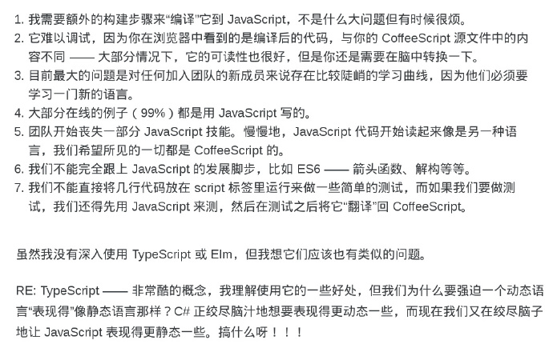

# typescript
教程: http://www.typescriptlang.org/docs/  

## Type
* any : 只要为元素指定了any类型,则可以对其任意赋值

## 强大特性
* rxjs

## http
interceptor
```javascript
interceptor():RequestOptions{
			const opts:RequestOptions = new RequestOptions()
			opts.headers = this.headers
			if (Cookie.load('token') && !opts.headers.get('Authorization')) {
				opts.headers.append('Authorization',
					'Bearer ' + Cookie.load('token').replace(/(^\")|(\"$)/g, ''))
			}
			opts.withCredentials = true
			return opts
		}
```

## 争议
@ruanyf发表微博表示typescript并无优势，只是相对JS增加了静态类型。
   
不过@玉伯表示在淘宝已经有应用，适合多人协作的项目，且希望喜欢 typescript 的人士投简历给他。

>  上一条转贴对 TypeScript 的看法，反响还挺热烈的，那我再补充一点最重要的原因，为什么 TypeScript 不会成功？
  因为它的唯一功能就是为JS加上静态类型，但是如果那样的话，为什么我不用Java或C++来写呢？后两者都已经可以编译成JS了。（接下条）  

>  未来的JS只是一个编译产物，任何语言都可以编译成JS。那时，TS对比Java或 C++一点优势都没有，而且还丧失了JS原有的动态灵活的特征，
   这注定了它最终将被抛弃。另外，很多公司的后台语言是Java，全栈方案一般是 Java + JS，肯定不会推Java + TS。 

> 既然说到静态类型，又想到几个问题：为什么TC39委员会从没考虑过将静态类型加入ES？为什么JS的发明人Brendan Eich
  从没表示过对TypeScript的喜爱？为什么没有Typed Python或者Typed Ruby？Web的本质到底是动态的还是静态的？

>  静态类型一个很有用场景：参数对象需要强检验时，可以省好多代码。但这大多发生在后端，前端需要强校验的场合很少，而且前端需求变化快，
生命周期短，类型系统是否值得需要权衡。我觉得前端（没说后端哦）只要文档充分结构清晰，就能很好维护。眼下，ng2就绑定TS，且看会否流行。  

> [查了一下 TC39 委员会的讨论记录，Angel Java Lopez 基本上说出了我的看法。](https://esdiscuss.org/topic/optional-strong-typing#content-20)  